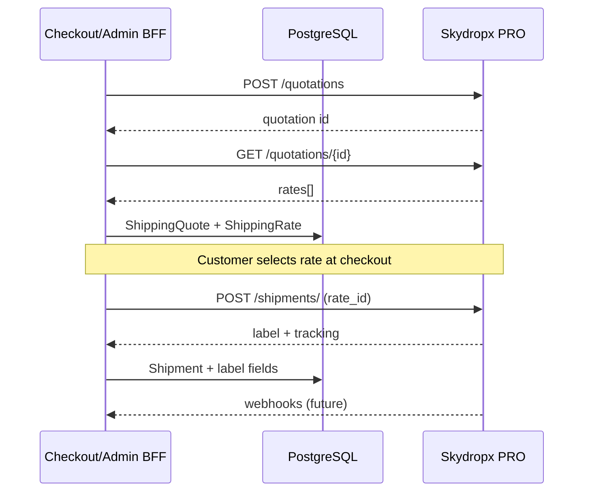

# Skydropx PRO — Shipping integration (Chef Room)

Chef Room uses **Skydropx PRO** (`api-pro.skydropx.com`) as the logistics aggregator for economical nationwide shipping in Mexico. This document covers the foundation layer, **Shipping Quote BFF** (`docs/graphql-shipping.md`), and **Admin Label BFF** (`docs/graphql-admin-shipping.md`). Admin UI for labels is a separate PR.

## Credentials

1. In Skydropx PRO: **Conexiones → API**
2. Copy **Client ID** and **Client Secret** (server-only)
3. Set in `.env.local`:

| Variable | Purpose |
|----------|---------|
| `SKYDROPX_ENV` | `sandbox` or `production` (logical label) |
| `SKYDROPX_API_BASE_URL` | Default `https://api-pro.skydropx.com` |
| `SKYDROPX_CLIENT_ID` | OAuth client id |
| `SKYDROPX_CLIENT_SECRET` | OAuth secret — never expose to the browser |
| `SKYDROPX_WEBHOOK_SECRET` | Webhook HMAC/Bearer/header (required in production) |

Missing credentials **do not** break `npm run build`. Any server call into the Skydropx client throws `SkydropxConfigError` at runtime.

## Authentication

- `POST /api/v1/oauth/token`
- `grant_type=client_credentials` with `client_id` and `client_secret` (`application/x-www-form-urlencoded`)
- Response: `access_token`, `expires_in` (7200 seconds = 2 hours)
- Implementation: `src/server/shipping/skydropx/skydropx.auth.ts` — in-memory cache per instance, refresh ~2 minutes before expiry
- **Rate limit:** 2 requests/second (account-level); `skydropx-rate-limit.ts` enforces 500ms spacing per serverless instance

For production at scale, consider **Redis** for shared token cache and request scheduling.

## API flow (target)



### Endpoints wrapped in client

| Method | Path | Client function |
|--------|------|-----------------|
| POST | `/api/v1/oauth/token` | `getSkydropxAccessToken` |
| POST | `/api/v1/quotations` | `createSkydropxQuotation` |
| GET | `/api/v1/quotations/{id}` | `getSkydropxQuotation` |
| POST | `/api/v1/shipments/` | `createSkydropxShipment` |
| GET | `/api/v1/shipments/{id}` | `getSkydropxShipment` |
| POST | `/api/v1/shipments/{id}/cancellations` | `cancelSkydropxLabelOrShipment` |
| GET | `/api/v1/shipments/tracking` | `getSkydropxTracking` |

## Origin (Puebla)

Defaults in `SHIPPING_VARS.origin` (`src/config/vars.ts`): postal code `72000`, city/state Puebla, country `MX`.

Optional per-environment overrides: `SHIPPING_ORIGIN_*` env vars. Resolved by `getShippingOriginConfig()` in `src/server/shipping/shipping.config.ts`.

## Standard package (chef apparel v1)

Tiered by total garment quantity (`SHIPPING_VARS.packageTiers` → `src/server/shipping/shipping.package.ts`):

| Quantity | Dimensions (L×W×H cm) | Weight (kg) |
|----------|------------------------|-------------|
| 1 | 30 × 20 × 5 | 0.5 |
| 2–3 | 35 × 25 × 8 | 0.9 |
| 4–6 | 40 × 30 × 12 | 1.5 |
| >6 | 40 × 30 × 12 | 1.5 + 0.15 kg per extra unit |

**Pending:** true multi-parcel shipments for large orders.

Single-garment defaults: `SHIPPING_VARS.defaultPackage`. Optional env overrides: `SHIPPING_DEFAULT_PACKAGE_*` (see `docs/configuration.md`).

## Database (Prisma)

- `ShippingQuote` — quote session linked to user/guest/cart/order
- `ShippingRate` — carrier options for a quote
- `ShippingWebhookEvent` — idempotent webhook inbox (not wired yet)
- `ShippingProvider.SKYDROPX`
- `Shipment` — provider, `providerShipmentId`, `labelUrl`, `quoteId`, `rateId`, `costCents`, `rawResponseJson` (migración `skydropx_shipments`)

## Code layout

```
src/server/shipping/
  shipping.config.ts
  shipping.package.ts
  skydropx/
    skydropx.config.ts
    skydropx.errors.ts
    skydropx.types.ts
    skydropx.auth.ts
    skydropx-rate-limit.ts
    skydropx.client.ts
    skydropx.mappers.ts
src/config/shipping.ts   # non-secret constants
```

All Skydropx modules use `import 'server-only'`.

## GraphQL BFF (v1)

Implemented in `src/server/graphql/modules/shipping/`:

- `createShippingQuote`, `shippingQuoteById`, `refreshShippingQuote`, `selectShippingRate`
- Hooks: `src/features/storefront/shipping/api/*` (UI not connected)

See `docs/graphql-shipping.md` for ownership, idempotency, and `recommendedRate` rules.

## Shipment mappers

`skydropx.mappers.ts`:

- `mapOrderToSkydropxShipmentPayload` — `rate_id`, origin, destination, `printing_format`
- `parseSkydropxShipmentResponse` — tracking, label URL, carrier, cost (defensivo)

## Debug de generación de guías

### Causas frecuentes

| Síntoma | Causa probable |
|---------|----------------|
| `502 Bad Gateway` | Skydropx caído, payload inválido, o origen incompleto enviado al API |
| Tarifa expirada | `ShippingRate.expiresAt` pasado — volver a cotizar en checkout |
| Dirección incompleta | Falta colonia (`Address.label`), número exterior (`line2`), teléfono, etc. |
| Origen incompleto | `SHIPPING_ORIGIN_*` vacíos; defaults en `vars.ts` no incluyen calle/teléfono |
| 401/403 | `SKYDROPX_CLIENT_ID` / `SECRET` incorrectos |
| Saldo / carrier | Cuenta Skydropx sin créditos o paquetería no habilitada |

### Endpoint admin (label)

- **POST** `{SKYDROPX_API_BASE_URL}/api/v1/shipments/` (mismo que cotización v1)
- Body: `{ shipment: { rate_id, printing_format, address_from, address_to } }`
- `rate_id` = `ShippingRate.providerRateId` de la cotización del pedido
- v2 (`POST /api/v2/shipments`) existe pero no usamos en v1 para no romper checkout

### Logging seguro

```env
SKYDROPX_DEBUG=true
```

En desarrollo también se activa sin la variable. Logs en servidor: operación, path, `orderNumber`, IDs de quote/rate, status HTTP y cuerpo **sanitizado** (sin Bearer, sin secrets).

### Script smoke (dry-run)

```bash
pnpm tsx scripts/skydropx-create-label-smoke.ts CR-2026-000027
pnpm tsx scripts/skydropx-create-label-smoke.ts CR-2026-000027 --send
```

Imprime payload sanitizado. Con `--send` llama a Skydropx (requiere credenciales en `.env.local`).

### Probar payload en Postman

1. Ejecuta el script **sin** `--send` y copia el JSON sanitizado.
2. Obtén Bearer con OAuth (`POST /api/v1/oauth/token`) desde el dashboard Skydropx — **no** pegues el token en docs ni commits.
3. `POST https://api-pro.skydropx.com/api/v1/shipments/` con el body del script.
4. Si Postman devuelve 502 → problema de cuenta/Skydropx/payload; si 201/202 → revisar headers/base URL en la app.

## v1 decisions

- Checkout usa `shippingRateId` y `shippingCents` desde DB
- Admin genera guía **después de producción**, no al pagar
- Mappers usan parsing defensivo (`unknown`) en respuestas Skydropx
- Webhook route: `POST /api/webhooks/skydropx` — see `docs/skydropx-webhooks.md`

## Pending (next PRs)

- [x] Checkout shipping quote BFF — `docs/graphql-shipping.md`
- [x] Admin label BFF — `docs/graphql-admin-shipping.md`
- [ ] Admin UI: botón "Generar guía" en drawer de pedidos
- [x] Skydropx webhooks — `docs/skydropx-webhooks.md`
- [ ] Pickups API
- [ ] Tracking UI for customers and admin
- [ ] Redis-backed OAuth token cache
- [ ] Production carrier activation in Skydropx dashboard
